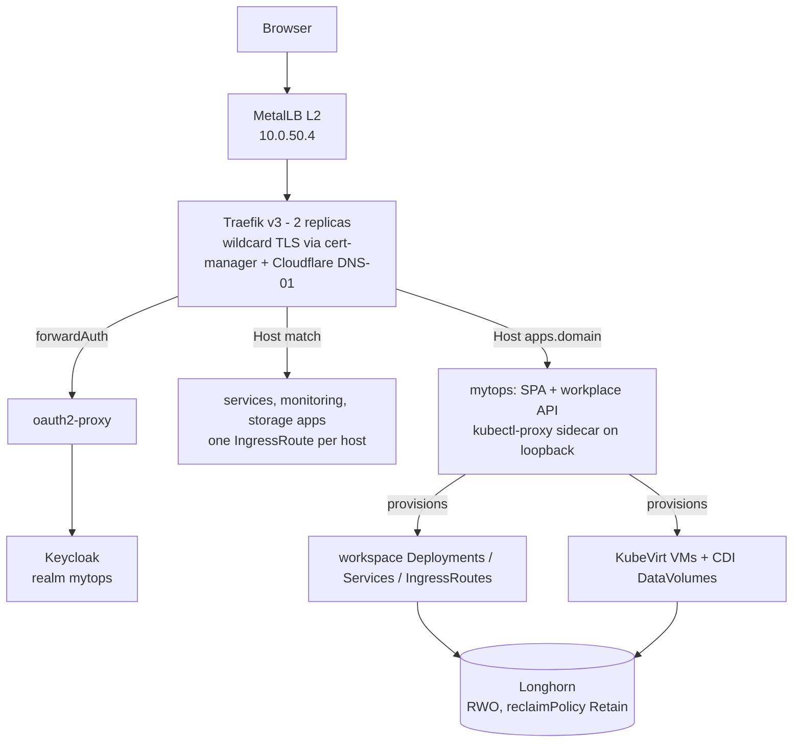

# nebula

A three-node Talos Kubernetes cluster at home, defined entirely in git: the machines
by an Omni cluster template, every workload by Flux, every secret by SOPS + age.
Push to `main` and the cluster converges. Nothing is configured by hand.

Three nodes is enough to be interesting and few enough to stay honest about the
limits: there is no live migration, no backup layer, and one node holds most of the
storage. Those limits are written down here instead of being discovered later.

## What runs here

| Layer | What | Where |
| --- | --- | --- |
| CNI | Cilium 1.20, installed once by the Omni template, manages itself after | `omni/cilium/` |
| Ingress | Traefik v3 (2 replicas), the only LoadBalancer service, `10.0.50.4` | `kubernetes/apps/network/` |
| Identity | oauth2-proxy in front of Keycloak (realm `mytops`), OIDC | `kubernetes/apps/auth/` |
| Certificates | cert-manager with a Cloudflare DNS-01 ClusterIssuer, wildcard cert | `kubernetes/apps/cert-manager/` |
| Storage | Longhorn 1.11, one replica by default, `longhorn-2-replicas` on request | `kubernetes/apps/storage/` |
| Virtualization | KubeVirt + CDI, one VM workspace today | `kubernetes/apps/kubevirt/` |
| Observability | kube-prometheus-stack, Loki, Promtail, blackbox probes per discovered host, Telegram alerts | `kubernetes/apps/monitoring/` |
| Workspaces | `mytops`: browser desktops and VMs, its own repository | `kubernetes/apps/services/mytops/` |
| Other apps | aiostreams, frigate (+ reolinkproxy), spottarr, stalker-stremio, uptime-kuma | `kubernetes/apps/services/` |
| Outside the cluster | homeassistant, obsidiansync - reachable through a Service + Endpoints pair that points at another machine | `kubernetes/apps/network/exposure/` |

Two applications keep their code and manifests in their own repositories, because
their CI builds artefacts that a GitOps repo should not contain:

| App | Repository | URL |
| --- | --- | --- |
| mytops | `Myrenic/mytops` | `https://apps.${SECRET_DOMAIN_0}` |
| mushroom-finder | `Myrenic/mushroom-finder` | `https://mushrooms.${SECRET_DOMAIN_0}` |

Each directory here holds only the deployment contract for them: a `GitRepository`
(`source.yaml`) plus a Flux `Kustomization` (`ks.yaml`) that points at `./base` in
that repository, sets `targetNamespace`, and substitutes `${...}` from
`cluster-secrets`.

## Architecture



Exposure is a decision, not an omission: a route is either behind
`oauth2-proxy-auth` (SSO), behind `lan-only` (RFC1918 source ranges), or explicitly
marked `testlab.io/exposure: public` with a comment saying why. CI fails the build if
a route is none of those.

## Repository layout

| Path | What |
| --- | --- |
| `omni/` | The cluster itself: the Omni template (machines, disk patches, Talos version) and the Cilium install manifest |
| `kubernetes/apps/` | Everything Flux applies, one directory per namespace, one subdirectory per app |
| `kubernetes/apps/network/exposure/` | The public surface: one file per host, plus middlewares, the wildcard certificate and the external endpoints |
| `kubernetes/apps/mytops-control/` | Cluster-scoped and cross-namespace grants for the workspace API, in one place |
| `kubernetes/apps/common/cluster-secrets.sops.yaml` | The only encrypted file in this repository |
| `kubernetes/bootstrap/` | Flux itself, applied once by hand (`kubectl apply -k`) |
| `docs/` | Cluster notes, incident reports, runbooks - see [docs/README.md](docs/README.md) |
| `scripts/check-manifests.sh` | Renders every Flux path and reports manifests no kustomization references |
| `.github/workflows/` | CI: manifest checks, secret audit, exposure gate, lint |

## How Flux is wired

`kubernetes/apps` is one Kustomization. It applies namespaces, the cluster-secrets
Secret, the vendored CRDs, and one Flux `Kustomization` object per app - and nothing
else. Each app directory follows the same shape:

```
kubernetes/apps/<namespace>/<app>/
  kustomization.yaml    # resources: [ks.yaml]  (what the root finds)
  ks.yaml               # a Flux Kustomization: path ./base, targetNamespace, substitutions
  base/
    kustomization.yaml  # the actual objects
    helmrelease.yaml    # ...usually one HelmRelease using the bjw-s app-template
```

Two deliberate exceptions, both because Flux rewrites namespaces:

- `kubernetes/apps/network/exposure/` is applied by its `ks.yaml` directly
  (`path: ./kubernetes/apps/network/exposure`), not through a `base/` directory:
  the routes, middlewares and the certificate are siblings on purpose, so the
  directory is readable as the list of reachable hosts.
- `kubernetes/apps/mytops-control/` sets no `targetNamespace` and is applied by the
  root Kustomization. Its objects each declare a namespace of their own (`network`,
  `storage`, `kubevirt`); a Flux Kustomization with `targetNamespace: services`
  would move every one of them into `services`, where they grant nothing.

Ordering is expressed with `dependsOn` instead of luck: `traefik` waits for
`cert-manager-issuers` and `metallb-pool`, every app with a volume waits for
`longhorn`, and the routes wait for the issuers that sign their certificate.

## Bootstrap

Prerequisites: `kubectl`/`kustomize`, a kubeconfig, and the SOPS age key (kept
outside this repository - `age.agekey` is gitignored on purpose). The cluster itself
is created from `omni/cluster-template.yaml`; see [docs/cluster.md](docs/cluster.md).

```bash
# 1. Install Flux (controllers + CRDs) and the git sync config in one shot.
#    This is the only thing the bootstrap file does; it is intentionally
#    self-contained and does NOT include secrets.
kubectl apply -k kubernetes/bootstrap

# 2. Give Flux the age key so the root Kustomization can decrypt the
#    *.sops.yaml files (spec.decryption is already configured on it).
kubectl -n flux-system create secret generic sops-age \
  --from-file=age.agekey=<path-to-age.agekey>

# 3. Watch Flux reconcile everything else.
flux get kustomizations --watch
```

Notes:

- The `GitRepository` clones `https://github.com/myrenic/nebula` anonymously (the
  repo is public). No deploy key is involved; if the repo ever becomes private,
  switch the URL in `kubernetes/apps/flux-system/flux-instance/gotk-sync.yaml` to
  `ssh://git@github.com/myrenic/nebula` and apply a decrypted `flux-system`
  deploy-key secret by hand.
- `kubernetes/apps/flux-system/flux-instance/flux-system-secret.sops.yaml` is kept
  only as an encrypted backup of the old deploy key and is not part of any
  kustomization.
- Two credentials are created by hand and are in no manifest: the oauth2-proxy
  client secret (`keycloak-webui-oauth` in `auth`) and the age key above. Both are
  documented in `kubernetes/apps/auth/README.md`. A rebuild from git alone therefore
  needs those two steps, which is the honest state of things.

## Adding an app

1. Pick the namespace under `kubernetes/apps/` - or add one directory with a
   `namespace.yaml` that carries the PodSecurity label the workload needs, plus
   `kustomize.toolkit.fluxcd.io/prune: disabled` so removing it from git cannot
   delete a namespace full of data.
2. Create `kubernetes/apps/<namespace>/<app>/{kustomization.yaml,ks.yaml,base/}` as
   above. Copy `ks.yaml` from a sibling app: `targetNamespace`, `interval: 1h`,
   `retryInterval: 1m`, `prune: true`, `path: ./kubernetes/apps/.../base`,
   `postBuild.substituteFrom: cluster-secrets`, and a `dependsOn` for anything the
   app needs first (`longhorn` for volumes, `cert-manager-issuers` for certificates).
3. Add the app directory to the namespace's `kustomization.yaml`, and the namespace
   to `kubernetes/apps/kustomization.yaml` if it is new.
4. Put the objects in `base/`. Prefer the bjw-s `app-template` HelmRelease with an
   `OCIRepository` next to it (five of the nine apps do); hand-written manifests are
   for things a chart cannot express, and then set `resources`, a
   `securityContext`, and readiness/liveness probes explicitly.
5. Add `kubernetes/apps/network/exposure/<app>.yaml` with the route. Choose
   `oauth2-proxy-auth`, `lan-only`, or `public` with a reason in a comment - CI
   enforces that choice either way.
6. Add any credential as a key in `cluster-secrets.sops.yaml` and reference it as
   `${VAR}`; see `kubernetes/apps/common/README.md` for the two traps (numbers lose
   their quotes, and the Secret is cluster-wide).
7. Run the checks below, then push. ConfigMaps do not hot-reload - if you changed a
   bundle, `kubectl -n <ns> rollout restart` the deployment that consumes it.

## Vendored and generated files

Four files in this repository are upstream artefacts rather than authored
manifests. They are committed so a bootstrap needs no network access beyond git:

| File | What it is | How it is updated |
| --- | --- | --- |
| `kubernetes/apps/kubevirt/operator/base/operator.yaml` | KubeVirt operator bundle (8.7k lines) | Renovate opens a PR and does **not** automerge it: the image tag and the CRDs have to move together (`manual-upgrade` label) |
| `kubernetes/apps/kubevirt/cdi/base/operator.yaml` | CDI operator bundle (5.8k lines) | Same |
| `kubernetes/apps/network/traefik-crds/crds.yaml` | Traefik CRDs, which the Helm chart does not ship | Same |
| `omni/cilium/cilium-install.yaml` | Cilium CRDs + chart in one manifest (21k lines) | `cd omni/cilium && CILIUM_VERSION=<v> ./generate.sh`, which fails the build if the result loses the Talos-critical settings |

The generated files also appear in `.yamllint`'s ignore list: they are never
reformatted here, because the next regeneration would undo it.

## Secrets

No secret is stored in this repository. `kubernetes/apps/common/cluster-secrets.sops.yaml`
holds `${...}` placeholders that Flux substitutes at build time from the
`cluster-secrets` Secret, which is itself the only SOPS-encrypted file here. Adding,
rotating and reading a value, plus the list of keys nothing references any more, is
documented in [kubernetes/apps/common/README.md](kubernetes/apps/common/README.md).

Two rules are enforced by CI, both because they were once broken: a `*.sops.yaml`
file must actually contain a `sops:` block and `ENC[` values, and no manifest may
carry a plaintext-looking value in a `data:`/`stringData:` block.

## Cross-namespace RBAC

The workspace API reaches the cluster through a `kubectl proxy` sidecar bound to the
pod's loopback interface, using one ServiceAccount (`mytops-control`). Because a
single Kustomization here cannot carry `targetNamespace` and still land grants in
several namespaces, every grant lives in one directory instead of next to the app it
serves:

| Grant | Namespace | File |
| --- | --- | --- |
| create/delete workspace IngressRoutes | `network` | `kubernetes/apps/mytops-control/network.yaml` |
| delete Longhorn volumes on VM teardown, reclaim CDI scratch volumes | `storage` | `kubernetes/apps/mytops-control/storage.yaml` |
| manage VirtualMachines, DataVolumes, their Secrets, Services and PVCs | `kubevirt` | `kubernetes/apps/mytops-control/kubevirt.yaml` |

Two consequences the API code has to respect: the network Role grants
`get/list/create/delete` and **no `update`**, so repairing a drifted route is
delete-then-create and a PUT is answered with 403; and the Longhorn CRs live in
`storage`, not in the operator's default namespace.

## CI and local checks

Every change that touches `kubernetes/**`, `omni/**`, `scripts/**`, `.github/**`,
`.sops.yaml`, `.yamllint`, `.editorconfig` or `README.md` runs:

| Gate | What it catches |
| --- | --- |
| Kustomize builds | `kubernetes/apps` and `kubernetes/bootstrap` must render |
| Flux path builds | every `spec.path` a Kustomization points at must render on its own |
| Orphan manifests | a YAML file under `kubernetes/` that no kustomization references is silently never applied; a file that is deliberately never applied declares it in its own first lines (`# not-applied: <reason>`) |
| kubeconform | schema errors on standard resources, with CRDs ignored rather than failing |
| yamllint | indentation, trailing whitespace, missing final newline |
| SOPS audit | a `*.sops.yaml` without a `sops:` block or `ENC[` values |
| Plaintext secrets | secret-looking literals in manifests |
| Exposure | a route with neither an auth middleware nor an explicit public annotation |

Locally, everything except kubeconform is one command:

```bash
bash scripts/check-manifests.sh      # roots + every Flux path + orphan report
yamllint -c .yamllint .
kubectl kustomize kubernetes/apps >/dev/null
```

Flux in-cluster checks its own health, so after a push:

```bash
flux reconcile kustomization flux-system --with-source
flux get kustomizations --status-selector ready=false
kubectl -n services rollout status deploy/mytops-webui --timeout=180s
```

## Operating notes

- **There is no backup layer right now.** Velero (with an Azure Blob location) was
  removed after its `backupstoragelocation/default` sat `Unavailable` for weeks, so
  every scheduled backup had been failing - a false sense of safety rather than a
  backup. State lives on Longhorn volumes with one replica by default and two where
  it matters; a node loss is survivable, a bad `kubectl delete` is not. Deleted
  objects come back from git only if Flux manages them. If a backup layer returns it
  must prove `Available`, and be verified by restoring one app into a scratch
  namespace, before anything trusts it.
- **Storage.** `defaultReplicaCount` and `defaultClassReplicaCount` are 1; the
  `longhorn-2-replicas` StorageClass is used where a second copy is worth the disk.
  The `longhorn-replica-adjuster` CronJob converges existing volumes to 2 replicas
  once at least two nodes are `Ready` (`frigate-media` is deliberately excluded) and
  back to 1 while the cluster is effectively single-node. StorageClasses use
  `volumeBindingMode: WaitForFirstConsumer` so replicas land after the pod is
  scheduled. Volumes use `reclaimPolicy: Retain`, so a deleted PVC leaves a released
  `volumes.longhorn.io` object behind: `kubectl -n storage get pv | grep Released`.
- **Access model.** Traefik terminates TLS with the cert-manager certificate
  `domain-0-prod` (Cloudflare DNS-01) and is the only LoadBalancer service
  (`10.0.50.4`, MetalLB L2 pool `10.0.50.4-10.0.50.6`). oauth2-proxy in front of
  Keycloak is the only authentication path; identity arrives as oauth2-proxy's
  headers, never from the client.
- **Workspace streams are owner-scoped.** Workspace IngressRoutes carry the
  `oauth2-proxy-auth` and `mytops-workspace-owner` middlewares; the second one asks
  the workplace API whether the signed-in user owns the host in the request, because
  a workspace host is derived from its owner's email and authentication alone would
  let any user in the realm open anyone's desktop.
- **Restore an individual app from git:**

  ```bash
  flux reconcile kustomization <app> -n flux-system --with-source
  ```

  Flux restores what is in git. Data on PVCs is not part of that: a deleted PVC
  comes back empty.

## Drills and cadence

The target is not 100% uptime, it is predictable self-healing. Weekly: confirm the
Longhorn replica policy still matches the risk, and that a stateful app survives a
pod reschedule. Monthly: run the failure drill below and write down what happened.
Act the same day, in git.

### Failure drill: 2 of 3 nodes unavailable

1. **Pre-check** - `kubectl get nodes`, `flux get kustomizations --status-selector
   ready=false`, `kubectl -n storage get volumes.longhorn.io` and note the
   healthy/degraded counts, and confirm one stateless and one stateful app are both
   healthy.
2. **Restore point** - there is no backup layer, so the restore point is the
   Longhorn replica set plus a git revision. Record `git rev-parse HEAD` and the
   volume state before draining.
3. **Simulate** - `kubectl cordon <node-a> <node-b>` then
   `kubectl drain <node-a> <node-b> --ignore-daemonsets --delete-emptydir-data --force`,
   then power off or disconnect both nodes. Expect degraded performance and some
   brief unavailability; ingress, DNS and Flux should recover on the surviving node.
4. **Verify (10-15 min)** - `kubectl get pods -A -o wide`,
   `kubectl -n storage get volumes.longhorn.io`, check the critical endpoints, and
   confirm Flux is still reconciling.
5. **Roll back** - power the nodes back on, `kubectl uncordon <node-a> <node-b>`,
   then wait for replica rebuild and pod rebalancing. Do not expect a restore path
   for anything the drill breaks.
