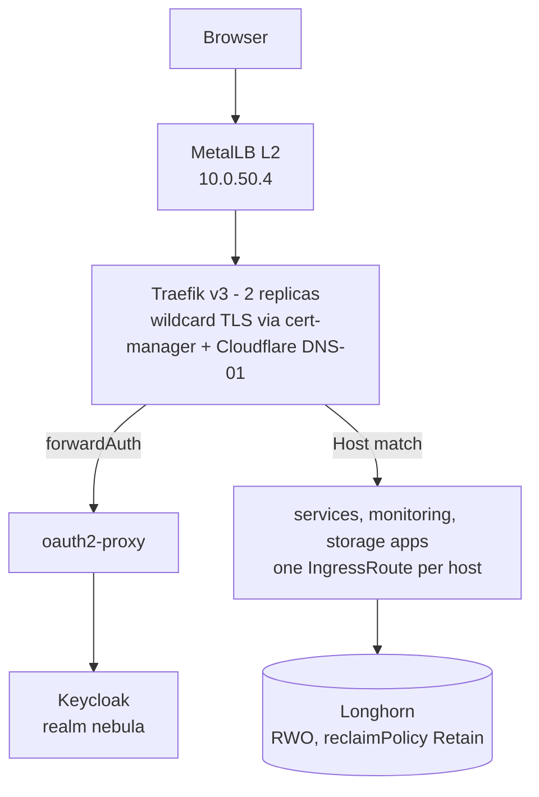

# nebula

A three-node Talos Kubernetes cluster at home, defined entirely in git: the machines
by an Omni cluster template, every workload by Flux, every secret by SOPS + age.
Push to `main` and the cluster converges. Nothing is configured by hand.

Three nodes is enough to be interesting and few enough to stay honest about the
limits: there is no live migration, one node holds most of the storage, and the
backup layer is young enough that its restore path has been drilled rather than
proven over years. Those limits are written down here instead of being discovered
later.

## What runs here

| Layer | What | Where |
| --- | --- | --- |
| CNI | Cilium 1.20, installed once by the Omni template, manages itself after | `omni/cilium/` |
| Ingress | Traefik v3 (2 replicas), the only LoadBalancer service, `10.0.50.4` | `kubernetes/apps/network/` |
| Identity | oauth2-proxy in front of Keycloak (realm `nebula`), OIDC; Keycloak's own `master` realm is for administration only | `kubernetes/apps/auth/` |
| Certificates | cert-manager with a Cloudflare DNS-01 ClusterIssuer, wildcard cert | `kubernetes/apps/cert-manager/` |
| Storage | Longhorn 1.13, one replica by default, `longhorn-2-replicas` on request | `kubernetes/apps/storage/` |
| Observability | kube-prometheus-stack, Loki, Grafana Alloy (shipping the logs), blackbox probes per discovered host, Telegram alerts | `kubernetes/apps/monitoring/` |
| Other apps | aiostreams, glance, open-webui, searxng, spottarr, stalker-stremio, uptime-kuma | `kubernetes/apps/services/` |
| frigate | the one workload that needs a privileged container (Intel iGPU), so it has a namespace of its own rather than making nine apps share that policy | `kubernetes/apps/frigate/` |
| Outside the cluster | homeassistant - reachable through a Service + Endpoints pair that points at another machine | `kubernetes/apps/network/exposure/` |

Two applications keep their code and manifests in their own repositories, because
their CI builds artefacts that a GitOps repo should not contain:

| App | Repository | URL |
| --- | --- | --- |
| lucian-ghost | `Myrenic/lucian-ghost` | `https://lucian.${SECRET_DOMAIN_0}` |
| mushroom-finder | `Myrenic/mushroom-finder` | `https://mushrooms.${SECRET_DOMAIN_0}` |

Each directory here holds only the deployment contract for them: a `GitRepository`
(`source.yaml`) plus a Flux `Kustomization` (`ks.yaml`) that points at `./base` in
that repository, sets `targetNamespace`, and substitutes `${...}` from
`cluster-secrets`.

## Architecture


```mermaid
flowchart TB
  browser["Browser"]
  lb["MetalLB L2<br/>10.0.50.4"]
  traefik["Traefik v3 - 2 replicas<br/>wildcard TLS via cert-manager + Cloudflare DNS-01"]
  oauth["oauth2-proxy"]
  keycloak["Keycloak<br/>realm nebula"]
  apps["services, monitoring, storage apps<br/>one IngressRoute per host"]
  longhorn[("Longhorn<br/>RWO, reclaimPolicy Retain")]

  browser --> lb --> traefik
  traefik -->|"forwardAuth"| oauth --> keycloak
  traefik -->|Host match| apps
  apps --> longhorn
```

Exposure is a decision, not an omission: a route is either behind
`oauth2-proxy-auth` (SSO), behind `lan-only` (RFC1918 source ranges), or explicitly
marked `testlab.io/exposure: public` with a comment saying why. CI fails the build if
a route is none of those.

## Repository layout

| Path | What |
| --- | --- |
| `omni/` | The cluster itself: the Omni template (machines, disk patches, Talos version) and the Cilium install manifest |
| `kubernetes/apps/` | Everything Flux applies, one directory per namespace, one subdirectory per app |
| `kubernetes/apps/network/exposure/` | The public surface: one file per host, plus middlewares, the wildcard certificate and the external endpoints |
| `kubernetes/apps/common/cluster-secrets.sops.yaml` | The shared bundle of substituted values - one of five SOPS-encrypted files here, and the only one that is not tied to a single app |
| `kubernetes/bootstrap/` | Flux itself, applied once by hand (`kubectl apply -k`) |
| `docs/` | Cluster notes, incident reports, runbooks - see [docs/README.md](docs/README.md) |
| `scripts/check-manifests.sh` | Renders every Flux path and reports manifests no kustomization references |
| `.github/workflows/` | CI: manifest checks, secret audit, exposure gate, lint |

## How Flux is wired

`kubernetes/apps` is one Kustomization. It applies namespaces, the cluster-secrets
Secret, the vendored CRDs, and one Flux `Kustomization` object per app - and nothing
else. Each app directory follows the same shape:

```
kubernetes/apps/<namespace>/<app>/
  kustomization.yaml    # resources: [./ks.yaml]  (what the root finds)
  ks.yaml               # a Flux Kustomization: path ./base, targetNamespace, substitutions
  base/
    kustomization.yaml  # the actual objects
    helmrelease.yaml    # ...usually one HelmRelease using the bjw-s app-template
```

Four rules keep every app directory identical in shape, so that a reader who knows
one app knows all of them:

- every `kustomization.yaml` opens with the `# yaml-language-server: $schema=...`
  line, so an editor validates it;
- every `resources` entry is `./`-prefixed, because a bare name reads as neither a
  file nor a directory;
- the list is sorted alphabetically, with `namespace.yaml` first, and nothing in it
  decides what is applied first - kustomize renders namespaces and CRDs ahead of the
  objects that use them;
- every `ks.yaml` states its `spec` keys in the same order - `targetNamespace`,
  `interval`, `retryInterval`, `timeout`, `prune`, `force`, `path`, `sourceRef`,
  `postBuild`, `decryption`, `dependsOn`, `wait`, `healthChecks` - and omits the ones
  it does not need rather than reordering the rest.

One deliberate exception, because Flux rewrites namespaces:

- `kubernetes/apps/network/exposure/` is applied by its `ks.yaml` directly
  (`path: ./kubernetes/apps/network/exposure`), not through a `base/` directory:
  the routes, middlewares and the certificate are siblings on purpose, so the
  directory is readable as the list of reachable hosts.

Ordering is expressed with `dependsOn` instead of luck: `traefik` waits for
`cert-manager-issuers` and `metallb-pool`, every app with a volume waits for
`longhorn`, and the routes wait for the issuers that sign their certificate.

## Bootstrap

Prerequisites: `kubectl`/`kustomize`, a kubeconfig, and the SOPS age key (kept
outside this repository - `age.agekey` is gitignored on purpose). The cluster itself
is created from `omni/cluster-template.yaml`; see [docs/cluster.md](docs/cluster.md).

```bash
# 1. Install Flux (controllers + CRDs) and the git sync config in one shot.
#    This is the only thing the bootstrap file does; it is intentionally
#    self-contained and does NOT include secrets.
kubectl apply -k kubernetes/bootstrap

# 2. Hand Flux the two secrets it needs before it can fetch or decrypt
#    anything. Both are in git and both are encrypted, so neither can be
#    delivered by the thing that needs it - apply them by hand, once:
#
#      sops-age     the age key the root Kustomization decrypts *.sops.yaml with
#      flux-system  the forge credential the GitRepository clones with
kubectl -n flux-system create secret generic sops-age \
  --from-file=age.agekey=<path-to-age.agekey>
sops -d kubernetes/apps/flux-system/flux-instance/flux-system-secret.sops.yaml \
  | kubectl apply -f -

# 3. Watch Flux reconcile everything else.
flux get kustomizations --watch
```

Note the order: Flux is installed before its credentials exist, so the first
reconcile fails with a missing secret and retries. That is expected, and it is
the price of not having a bootstrap step that needs the cluster to already work.

Notes:

- **Where the repository lives.** `code.tuntelder.com/mtuntelder/nebula`, on the
  forge, private, over HTTPS. Not SSH: the forge publishes only :443 through
  Cloudflare, so port 2222 is not reachable from inside the cluster (checked, not
  assumed). The credential in `flux-system-secret.sops.yaml` is an access token;
  it carries repository *write* today, which is more than a pull mirror needs -
  replacing it with a `read:repository` token is a two-minute job and is written
  down at the top of that file.
- The old GitHub copy (`github.com/myrenic/nebula`) is no longer read by
  anything. It exists as a mirror, and it is the reason the leaked Cilium CA key
  had to be rotated rather than merely deleted: it was public there.
- What is still created by hand, and why each one has to be:
  1. the age key above, because Flux needs it to read everything else;
  2. the forge credential (`flux-system-secret.sops.yaml`), because Flux needs it
     to fetch the repository that contains it;
  3. the `keycloak-webui-oauth` Secret - oauth2-proxy's client id, client secret
     and cookie secret. The realm itself is no longer on this list: it lives in
     `kubernetes/apps/auth/keycloak/base/realm/nebula.json` and is imported by a
     Flux-managed job that creates the realm when it is missing and leaves a live
     one alone, so a rebuild gets its realm and client from git. What git cannot
     hold is the client secret that the realm *must agree with*, and that is this
     Secret; the realm import reads it from there rather than from a second copy.
  4. a user account. The realm has no users in git, on purpose.

  So a rebuild from git needs those four steps and nothing else. Which of them
  could be removed: the cookie secret is already in `cluster-secrets` as
  `OAUTH2_PROXY_COOKIE_SECRET`, so a templated Secret could carry all three keys
  and take (3) off the list - it was left alone here because swapping a live SSO
  client secret cannot be verified without completing a real login flow.
- One credential lives outside git *and* outside Keycloak: the read-only Proxmox
  token the dashboard's `proxmox` widget reads. On the Proxmox host (`pve`,
  `10.0.50.11`) there is a group `api-ro` (role `PVEAuditor` at `/`), a user
  `glance@pve` in it, and a token `glance@pve!glance` with the same role; the
  token's value is in `cluster-secrets` as `PROXMOX_TOKEN`, so a rebuild needs it
  reissued (`pveum user token add glance@pve glance`) and the new value written
  there. A `PVEAuditor` token can read the cluster's inventory and cannot change
  anything - and, like every token in Proxmox, it is scoped by the ACLs on the
  user and on the token, which is why both are granted here.

## Adding an app

1. Pick the namespace under `kubernetes/apps/` - or add one directory with a
   `namespace.yaml` that carries the PodSecurity label the workload needs, plus
   `kustomize.toolkit.fluxcd.io/prune: disabled` so removing it from git cannot
   delete a namespace full of data.
2. Create `kubernetes/apps/<namespace>/<app>/{kustomization.yaml,ks.yaml,base/}` as
   above. Copy `ks.yaml` from a sibling app and keep the `spec` key order described
   under How Flux is wired: `targetNamespace`, `interval: 1h`, `retryInterval: 1m`,
   `timeout: 5m`, `prune: true`, `path: ./kubernetes/apps/<namespace>/<app>/base`,
   `sourceRef` to `flux-system`, `postBuild.substituteFrom: cluster-secrets`, and a
   `dependsOn` for anything the app needs first (`longhorn` for volumes,
   `cert-manager-issuers` for certificates).
3. Add the app directory to the namespace's `kustomization.yaml` (alphabetically, so
   the diff is one line), and the namespace to `kubernetes/apps/kustomization.yaml`
   if it is new.
4. Put the objects in `base/`. Prefer the bjw-s `app-template` HelmRelease with an
   `OCIRepository` next to it; hand-written manifests are for things a chart cannot
   express, and then set `resources`, a `securityContext`, and readiness/liveness
   probes explicitly.
5. Add `kubernetes/apps/network/exposure/<app>.yaml` with the route. Choose
   `oauth2-proxy-auth`, `lan-only`, or `public` with a reason in a comment - CI
   enforces that choice either way.
6. Add any credential as a key in `cluster-secrets.sops.yaml` and reference it as
   `${VAR}`; see `kubernetes/apps/common/README.md` for the two traps (numbers lose
   their quotes, and the Secret is cluster-wide).
7. Run the checks below, then push. ConfigMaps do not hot-reload - if you changed a
   bundle, `kubectl -n <ns> rollout restart` the deployment that consumes it.

## Vendored and generated files

Two files in this repository are upstream artefacts rather than authored
manifests. They are committed so a bootstrap needs no network access beyond git:

| File | What it is | How it is updated |
| --- | --- | --- |
| `kubernetes/apps/network/traefik-crds/crds.yaml` | Traefik CRDs, which the Helm chart does not ship | Renovate opens a PR and does **not** automerge it (`manual-upgrade` label): the bundle has to move with the traefik image in `network/traefik/base/deployment.yaml` |
| `omni/cilium/cilium-install.yaml` | Cilium CRDs + chart in one manifest (21k lines) | `cd omni/cilium && CILIUM_VERSION=<v> ./generate.sh`, which refuses to finish if the result loses a Talos-critical setting or contains private key material; `./generate.sh --check` re-runs those checks against the committed file and is what CI calls |

The generated files also appear in `.yamllint`'s ignore list: they are never
reformatted here, because the next regeneration would undo it.

Two traps belong with that table, both learned the hard way:

- **`mode: one-time` means the file is applied once, at bootstrap.** Regenerating
  `cilium-install.yaml` therefore changes nothing on a cluster that is already
  running: Omni applies it to a *new* machine and never again. Upgrading Cilium is
  `./generate.sh`, then applying the manifest to the running cluster yourself
  (`kubectl apply -f omni/cilium/cilium-install.yaml`), then syncing the template.
  Cilium has no Helm release in this cluster to upgrade, which is why the manual
  step exists at all.
- **Certificate material rotates in-cluster, not in git.** `hubble.tls.auto.method:
  cronJob` means the manifest carries no CA and no private key; the
  `hubble-generate-certs` job in `kube-system` (CronJob `0 0 1 */4 *`, plus a
  one-shot Job at install time) generates them and reuses what it finds. It
  reuses the CA, so a *reroll* is: delete `cilium-ca` and the `hubble-*` TLS
  secrets, run a job from the CronJob, then roll `ds/cilium` and
  `deploy/hubble-relay` so they pick the new material up. A leaked CA is the
  reason that procedure exists, and the leaves are valid for a year against a CA
  valid for three.

## Secrets

No secret is stored in this repository. `kubernetes/apps/common/cluster-secrets.sops.yaml`
holds `${...}` placeholders that Flux substitutes at build time from the
`cluster-secrets` Secret, which is itself the only SOPS-encrypted file here. Adding,
rotating and reading a value, plus the list of keys nothing references any more, is
documented in [kubernetes/apps/common/README.md](kubernetes/apps/common/README.md).

Two rules are enforced by CI, both because they were once broken: a `*.sops.yaml`
file must actually contain a `sops:` block and `ENC[` values, and no manifest may
carry a plaintext-looking value in a `data:`/`stringData:` block.

## CI and local checks

The gates live in **`scripts/validate.sh`**, so "checked" means one thing whether it
runs against a hand-written change or a dependency bump:

| Gate | What it catches |
| --- | --- |
| Kustomize builds | `kubernetes/apps` and `kubernetes/bootstrap` must render |
| Flux path builds | every `spec.path` a Kustomization points at must render on its own |
| Orphan manifests | a YAML file under `kubernetes/` that no kustomization references is silently never applied; a file that is deliberately never applied declares it in its own first lines (`# not-applied: <reason>`) |
| SOPS audit | a `*.sops.yaml` without a `sops:` block or `ENC[` values |
| Plaintext secrets | secret-looking literals in manifests |
| Exposure | a route with neither an auth middleware nor an explicit public annotation |
| yamllint | indentation, trailing whitespace, missing final newline |
| kubeconform | schema errors on standard resources, with CRDs ignored rather than failing |

Run the whole suite locally - it needs `kubectl`, `git`, `python3`, `yamllint` and
`kubeconform`, and says so loudly if one is missing rather than skipping a gate:

```bash
scripts/validate.sh
```

Two workflows call it:

- **`validate-changes.yaml`** - a push to `main`, and human pull requests.
- **`validate-renovate.yaml`** - every branch Renovate proposes, run when the
  Renovate workflow finishes. It validates **main + that branch** (the tree that
  would land), and reports the result as a `renovate/validate` commit status on the
  branch head.

### Why dependency PRs need their own workflow

A pull request opened by `GITHUB_TOKEN` gets its `pull_request` runs held as
`action_required`: GitHub waits for a human to approve the run, which for an
unattended dependency flow means the checks never run. `workflow_run` is not held,
so that is what drives the validation above. Consequences worth knowing:

- Dependency PRs show the validation as a `renovate/validate` status; their
  `Validate Changes` run sits at `action_required` until somebody clicks *Approve and
  run workflows*. Adding a `RENOVATE_TOKEN` (fine-grained PAT or GitHub App) to the
  Renovate workflow makes PRs trigger CI normally as well - the workflow already
  prefers it when it exists.
- Each branch is marked `pending` before it is validated, so a validator that dies
  halfway leaves the branch pending instead of looking green. Nothing merges on an
  unvalidated branch.
- `renovate.json` automerges digest/pin/patch - **not** minor or major - with
  `platformAutomerge: false`: leaving that on would let GitHub merge as soon as the
  repository's *required* checks pass, and this repository deliberately has none, so
  a bump would land before the validation finished. With it off, Renovate merges on
  a later run once the branch carries a green `renovate/validate`. Minor bumps
  change defaults in charts that run storage and ingress, and the validation these
  branches get is shape-only, so they wait for a human; the packageRule says so.

Pushing to `main` stays the normal path for hand-written changes. Flux reports its own
health after a push, so:

```bash
flux reconcile kustomization flux-system --with-source
flux get kustomizations --status-selector ready=false
```

## Operating notes

- **Backup layer: Velero to Azure Blob.** The previous installation was removed on
  2026-09-21 after `backupstoragelocation/default` sat `Unavailable` for weeks, so
  every schedule had been failing silently. Two things had gone wrong, and both are
  addressed rather than re-pinned: the location pointed at resource group
  `Velero_Backups` and storage account `velero76b1f66a064d`, **neither of which
  exists in the subscription any more**; and its service principal's `velero` client
  secret expired on 2026-09-21, six months after it was created. What runs now
  authenticates with a storage account access key (`storageAccountKeyEnvVar:
  AZURE_STORAGE_ACCOUNT_ACCESS_KEY`) against an account that is in current use -
  `tuntelderbackupee3949`, already holding the fileserver's Immich dumps - so
  there is no expiring principal and no Azure AD role in the path. Two schedules,
  `apps-daily` (02:13, 7-day TTL) and `apps-monthly` (1st, 04:13, 60-day TTL),
  cover the `auth`, `frigate` and `services` namespaces and copy volume contents
  with Kopia: this cluster has no `snapshot.storage.k8s.io` CRDs at all, so
  `snapshotsEnabled` is false and file-system backup is the only way a volume can
  come back. The schedules are wall-clock Amsterdam times because `TZ` is pinned
  to `${TZ}` from cluster-secrets on the Velero deployment; without that, Velero
  reads a cron schedule in the container's local time, which is UTC, and every
  backup in this paragraph would fire two hours later than it says in summer.
  Scope is by **namespace, not by label**, and that is load-bearing: three
  credentials exist only in the cluster and in no manifest -
  `keycloak-webui-oauth`, `mushroom-finder-db` and `lucian-ghost-backup` - so any
  selector-shaped backup would silently skip the objects nothing else can replace.
  `frigate-media` opts its recordings out with
  `backup.velero.io/backup-volumes-excludes`: that volume is declared 50 GiB and
  fills with continuous recordings, which is exactly why it is the one dataset
  worth *not* copying; the rest of those namespaces is about
  11 GiB. Monitoring in `rules/prometheusrule-backup-health.yaml` alerts on an
  unavailable location, a stale schedule, a failing backup, a node-agent that is
  not ready on every node, and - deliberately - on the metric going missing
  entirely, which is what happens when the layer is quietly uninstalled. See
  "Restore an app" under Drills and cadence.
- **Storage.** `defaultReplicaCount` and `defaultClassReplicaCount` are 1; the
  `longhorn-2-replicas` StorageClass is used where a second copy is worth the disk.
  The `longhorn-replica-adjuster` CronJob only ever *raises* a volume to 2 replicas,
  and only while at least two nodes are `Ready`; it never lowers one. It used to
  drop every volume to 1 when a node was missing, which is precisely when a second
  copy is worth having, and every oscillation forced a rebuild. Shrinking is now a
  deliberate patched setting, and the file says so. Volumes opt out of the raise
  either by name (`frigate-media`, whose recordings are not worth a second copy) or
  with the label `nebula.tuntelder.com/replica-count: "1"`.
  StorageClasses use `volumeBindingMode: WaitForFirstConsumer` so replicas land
  after the pod is scheduled. Volumes use `reclaimPolicy: Retain`, so a deleted PVC
  leaves a released `volumes.longhorn.io` object behind - and a second CronJob,
  `longhorn-released-volume-report`, counts those daily instead of leaving it to
  whoever remembers `kubectl -n storage get pv | grep Released`.
- **Access model.** Traefik terminates TLS with the cert-manager certificate
  `domain-0-prod` (Cloudflare DNS-01) and is the only LoadBalancer service
  (`10.0.50.4`, MetalLB L2 pool `10.0.50.4-10.0.50.6`). oauth2-proxy in front of
  Keycloak is the authentication path for everything behind `oauth2-proxy-auth`;
  the routes marked public answer with their own accounts or with none. Identity
  arrives as oauth2-proxy's headers, never from the client.
  Keycloak's own admin console is the one console that is neither public nor
  behind SSO: `PathPrefix('/admin')` on that host carries `lan-only`, because a
  login page has to be reachable before anyone has a session and an admin console
  does not. The `lan-only` ranges are deliberately all of RFC1918 - the LAN is
  segmented into per-VLAN /24s and the VPN terminates into `192.168.x`, so a
  narrower list would lock out legitimate clients; the middleware is a
  segmentation boundary, not an internet boundary.
- **The forge is not in the cluster.** It runs on the Proxmox host (`pve`,
  `10.0.50.11`) in LXC 114, reached at `code.${SECRET_DOMAIN_0}`. Its compose,
  theme and deploy step live in `mtuntelder/forge-stack` on the forge itself, and a
  systemd timer deploys them (`git pull` -> theme sync -> `compose pull && up`);
  a Renovate PR that bumps the pinned Forgejo tag is the whole upgrade. CI runs in
  **LXC 115**, a separate guest, registered as the `self-hosted` Actions runner -
  kept apart so a job never executes beside the instance that holds the
  repositories. Nothing here deploys any of it: the in-cluster Forgejo this
  replaced could not host the repository the cluster converges from, which is why
  it went.
- **The sign-in pages are themed from git as well.**
  `kubernetes/apps/auth/keycloak/base/theme/` holds a `theme.properties` and one
  stylesheet, shipped as the `keycloak-theme` ConfigMap and mounted file by file
  under `/opt/keycloak/themes/nebula/`, for the same reason as the forge's: a
  ConfigMap is flat and a theme is a directory tree. The theme inherits Keycloak's
  own templates and only paints over them, so an upgrade moves the markup under it
  and the pages stay themed. Which theme a realm uses is a realm setting -
  `loginTheme: nebula`, hand-made with the rest of realm `nebula`, see
  `kubernetes/apps/auth/README.md`. Two caches sit on top of that: theme files are
  cached in memory by a production server, and the browser holds the stylesheet
  under a URL that does not change when the file does, so after a theme change,
  `kubectl -n auth rollout restart deploy/keycloak`. The browser's copy is capped
  at ten minutes rather than Keycloak's 30-day default
  (`KC_SPI_THEME_STATIC_MAX_AGE`), so the next visit picks it up; a hard reload
  does it immediately.
- **Restore an individual app from git:**

  ```bash
  flux reconcile kustomization <app> -n flux-system --with-source
  ```

  Flux restores what is in git. Data on PVCs is not part of that: a deleted PVC
  comes back empty. For the data, and for the three credentials that are in no
  manifest, see "Restore an app" under Drills and cadence.

## Drills and cadence

The target is not 100% uptime, it is predictable self-healing. Weekly: confirm the
Longhorn replica policy still matches the risk, and that a stateful app survives a
pod reschedule. Monthly: run the failure drill below and write down what happened.
Act the same day, in git.

### Restore an app

Two different things can be "restored", and they have different sources: the
manifests come from git, the data comes from Velero. Flux already puts the
manifests back, so a restore is normally about the volume contents and the three
credentials that exist in no manifest.

```bash
# What is there to restore from. Note the resource is `backups.velero.io`:
# `backups` alone resolves to Longhorn's CRD and answers "not found" while
# looking perfectly successful.
kubectl -n velero get backups.velero.io
```

Whole-backup restore - every app in `auth` and `services`, PVCs recreated and
repopulated, no manual PV work:

```bash
kubectl -n velero create -f - <<'EOF'
apiVersion: velero.io/v1
kind: Restore
metadata:
  name: restore-all
spec:
  backupName: apps-daily-20260927021301   # from the list above
EOF
```

One app, into a scratch namespace (this is the command the drill below runs):

```bash
kubectl create namespace open-webui-restore

kubectl -n velero create -f - <<'EOF'
apiVersion: velero.io/v1
kind: Restore
metadata:
  name: open-webui-restore
spec:
  backupName: apps-daily-20260927021301
  includedNamespaces: [services]
  orLabelSelectors:
    - matchLabels:
        app.kubernetes.io/name: open-webui
  namespaceMapping:
    services: open-webui-restore
EOF

kubectl -n velero get restores.velero.io
kubectl -n velero get podvolumerestores.velero.io   # one per volume, this is the data
```

The label selector is the part to get right: a restore carries a volume only when
the PVC's labels match, and the Helm charts here label each PVC with its app's
`app.kubernetes.io/name`, so a selector on that name brings the app back with its
data. Keycloak needs no selector - it is the whole of namespace `auth`, hand-made
secret included - so `includedNamespaces: [auth]` is the complete form.

`existingResourcePolicy` defaults to keeping whatever is already there. Restoring
*over* a live namespace therefore does nothing to existing PVCs; set
`existingResourcePolicy: Update` when the intent is to overwrite.

**A volume is skipped when its pod is not running at backup time**, and Velero
records that as a skip rather than a failure. That is not visible in the Backup
status - `volumeInfo` only exists in the object store - so it takes the CLI to
see it:

```bash
velero backup describe <name> --details     # look for SKIPPED in the volume list
```

It has bitten once: a volume was skipped because its pod was mid-rollout when the
backup ran, and the backup still reported `Completed`. Treat a cleanup/rollout
that lands across 02:13 as worth re-running the backup for.

### Failure drill: 2 of 3 nodes unavailable

1. **Pre-check** - `kubectl get nodes`, `flux get kustomizations --status-selector
   ready=false`, `kubectl -n storage get volumes.longhorn.io` and note the
   healthy/degraded counts, and confirm one stateless and one stateful app are both
   healthy.
2. **Restore point** - record `git rev-parse HEAD`, note the Longhorn volume state,
   and confirm the last backup is a good one: `kubectl -n velero get backups.velero.io`.
   A drain moves pods, so a schedule that fires mid-drill can skip volumes; that is
   a reason to know the last good backup before starting, not to take a new one.
3. **Simulate** - `kubectl cordon <node-a> <node-b>` then
   `kubectl drain <node-a> <node-b> --ignore-daemonsets --delete-emptydir-data --force`,
   then power off or disconnect both nodes. Expect degraded performance and some
   brief unavailability; ingress, DNS and Flux should recover on the surviving node.
4. **Verify (10-15 min)** - `kubectl get pods -A -o wide`,
   `kubectl -n storage get volumes.longhorn.io`, check the critical endpoints, and
   confirm Flux is still reconciling.
5. **Roll back** - power the nodes back on, `kubectl uncordon <node-a> <node-b>`,
   then wait for replica rebuild and pod rebalancing. Do not expect a restore path
   for anything the drill breaks.
